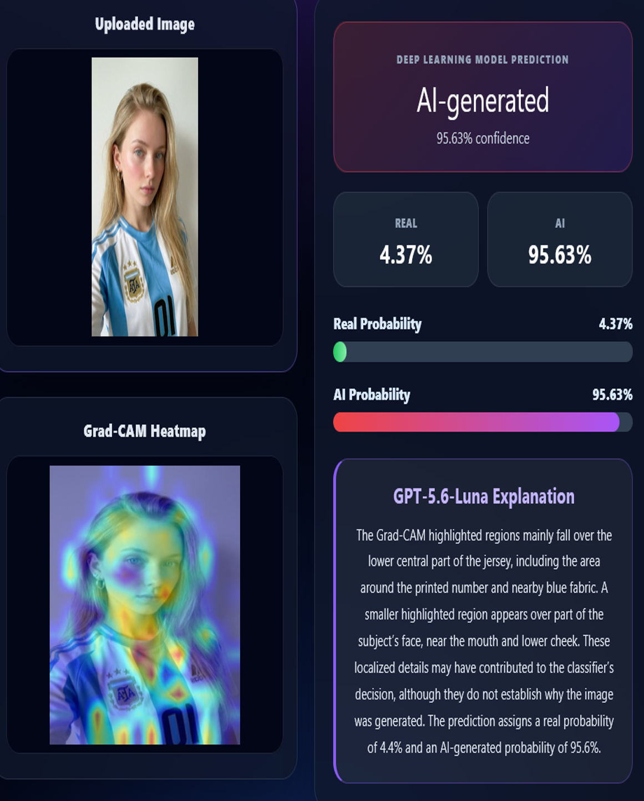

# DeepCheck AI

An Explainable AI-powered multimedia forensic system for detecting AI-generated images using a fine-tuned SigLIP Vision Transformer and Grad-CAM visual explanations.


---

# Overview

DeepCheck AI is an end-to-end Explainable AI (XAI) web application for detecting AI-generated images.

The system combines a fine-tuned **SigLIP Vision Transformer** with **Grad-CAM** and **OpenAI GPT-5.6 Luna** to provide both image classification and human-readable explanations of the regions that contributed most strongly to each prediction.

The application is deployed using a production-style architecture consisting of a React frontend, FastAPI backend, Docker containers, Nginx reverse proxy, and AWS EC2.

---
# Screenshot 


---

# Features

- AI-generated image detection
- Fine-tuned SigLIP Vision Transformer
- Explainable AI using Grad-CAM
- Natural-language explanation using OpenAI GPT-5.6 Luna
- React frontend
- FastAPI backend
- Docker deployment
- AWS EC2 hosting
- Nginx reverse proxy
- GitHub Actions CI/CD pipeline

---

# System Architecture

```text
                          User
                            │
                            ▼
                     React Frontend
                            │
                            ▼
                        Nginx (Port 80)
                            │
            ┌───────────────┴───────────────┐
            ▼                               ▼
      Static React Files              FastAPI Backend
                                              │
                 ┌────────────────────────────┼────────────────────────────┐
                 ▼                            ▼                            ▼
      SigLIP Vision Transformer          Grad-CAM                 GPT-5.6 Luna
                 │                            │                            │
                 └────────────────────────────┴────────────────────────────┘
                                              │
                                              ▼
                                     Prediction Response
```

---

# Explainability Pipeline

1. User uploads an image.
2. The SigLIP Vision Transformer predicts whether the image is **Real** or **AI-generated**.
3. Grad-CAM generates a heatmap highlighting the regions that contributed most strongly to the prediction.
4. The original image and Grad-CAM overlay are sent to **OpenAI GPT-5.6 Luna**.
5. GPT analyses the highlighted regions and generates a concise explanation suitable for non-technical users.
6. The frontend displays:
   - Prediction
   - Confidence
   - Real probability
   - AI-generated probability
   - Grad-CAM visualization
   - Natural-language explanation

---

# Technologies

### Machine Learning

- PyTorch
- Hugging Face Transformers
- SigLIP Vision Transformer
- Grad-CAM

### Backend

- FastAPI
- OpenAI API
- Pillow
- OpenCV

### Frontend

- React
- JavaScript
- HTML
- CSS

### Deployment

- Docker
- Docker Compose
- AWS EC2
- Nginx
- GitHub Actions

---

# Deployment Guide (AWS EC2 + Docker + Nginx)

## 1. Launch an EC2 Instance

- Launch an Ubuntu 24.04 LTS EC2 instance.
- Increase the root EBS volume to **30 GB**.
- Create and download the SSH key (`.pem`).

### Open the following inbound ports in the Security Group

| Port | Purpose |
|------:|---------|
| 22 | SSH |
| 80 | React Frontend (Nginx) |
| 8000 | FastAPI Backend |

---

## 2. Connect to EC2

```bash
ssh -i deepcheck-key.pem ubuntu@<EC2_PUBLIC_IP>
```

---

## 3. Install Docker

```bash
sudo apt update

sudo apt install docker.io docker-compose-v2 git -y

sudo systemctl enable docker

sudo systemctl start docker

sudo usermod -aG docker ubuntu

newgrp docker
```

Verify installation:

```bash
docker --version

docker compose version
```

---

## 4. Clone the Repository

```bash
git clone <repository-url>

cd AiImageDetection
```

---

## 5. Copy the Trained Model

From your local machine:

```bash
scp -i deepcheck-key.pem ./best_openfake_siglip50k.pth \
ubuntu@<EC2_PUBLIC_IP>:/home/ubuntu/AiImageDetection/Backend/models/
```

---

## 6. Configure Environment Variables

Create:

```text
Backend/.env
```

Example:

```env
OPENAI_API_KEY=YOUR_OPENAI_API_KEY
```

---

## 7. Build and Run Docker

```bash
cd Backend

docker compose up -d --build
```

Useful commands:

```bash
docker ps

docker logs deepcheck-backend

docker compose down

docker compose up -d

docker compose up -d --build
```

---

## 8. Verify Backend

```bash
curl http://127.0.0.1:8000/
```

Expected response:

```json
{
  "message":"AI Image Detector backend is running"
}
```

Swagger UI:

```
http://<EC2_PUBLIC_IP>:8000/docs
```

---

## 9. Build React Frontend

```bash
npm install

npm run build
```

This generates:

```text
dist/
```

---

## 10. Upload React Build

```bash
scp -i deepcheck-key.pem -r ./dist \
ubuntu@<EC2_PUBLIC_IP>:/home/ubuntu/
```

---

## 11. Install Nginx

```bash
sudo apt install nginx -y

sudo systemctl enable nginx

sudo systemctl start nginx
```

---

## 12. Deploy React

```bash
sudo rm -rf /var/www/html/*

sudo cp -r ~/dist/* /var/www/html/

sudo chown -R www-data:www-data /var/www/html

sudo chmod -R 755 /var/www/html
```

---

## 13. Configure Nginx

Edit:

```bash
sudo nano /etc/nginx/sites-available/default
```

Configuration:

```nginx
server {

    listen 80;

    client_max_body_size 50M;

    root /var/www/html;

    index index.html;

    location / {
        try_files $uri /index.html;
    }

    location /predict {
        proxy_pass http://127.0.0.1:8000/predict;
    }

    location /gradcam {
        proxy_pass http://127.0.0.1:8000/gradcam;
    }

    location /docs {
        proxy_pass http://127.0.0.1:8000/docs;
    }

    location /openapi.json {
        proxy_pass http://127.0.0.1:8000/openapi.json;
    }
}
```

Verify:

```bash
sudo nginx -t
```

Restart:

```bash
sudo systemctl restart nginx
```

---

## 14. Configure React

```javascript
const API_URL="/predict";

const BACKEND_URL="";
```

Rebuild:

```bash
npm run build
```

Upload the updated `dist` folder.

---

## 15. Verify Deployment

Frontend

```
http://<EC2_PUBLIC_IP>
```

Backend

```
http://<EC2_PUBLIC_IP>:8000/docs
```

---

## Troubleshooting

### Backend not running

```bash
docker ps

docker logs deepcheck-backend
```

---

### Backend API

```bash
curl http://127.0.0.1:8000/
```

---

### Verify Nginx

```bash
sudo nginx -t

sudo systemctl restart nginx
```

---

### Large image upload (413)

Add:

```nginx
client_max_body_size 50M;
```

Restart Nginx.

---

### React cannot connect to backend

Ensure:

```javascript
const API_URL="/predict";
```

Not

```javascript
http://127.0.0.1:8000
```

---

# Final Deployment Architecture

```text
                           Internet
                               │
                               ▼
                        AWS EC2 Instance
                               │
                               ▼
                       Nginx (Port 80)
                               │
               ┌───────────────┴───────────────┐
               ▼                               ▼
        React Frontend                 FastAPI Backend
                                               │
                     ┌─────────────────────────┼─────────────────────────┐
                     ▼                         ▼                         ▼
          SigLIP Vision Transformer       Grad-CAM             OpenAI GPT-5.6 Luna
                     │                         │                         │
                     └─────────────────────────┴─────────────────────────┘
                                               │
                                               ▼
                                    Explainable Prediction
```

---

# Future Improvements

- Attention Rollout for Vision Transformers
- Batch image prediction
- Multiple Vision Transformer backbones
- Support for additional AI image generators
- Explainability confidence scoring
- Mobile application

---

# Acknowledgements

This project uses:

- SigLIP Vision Transformer
- Hugging Face Transformers
- PyTorch
- FastAPI
- React
- OpenCV
- OpenAI GPT-5.6 Luna
- Grad-CAM
- Docker
- Nginx
- AWS EC2